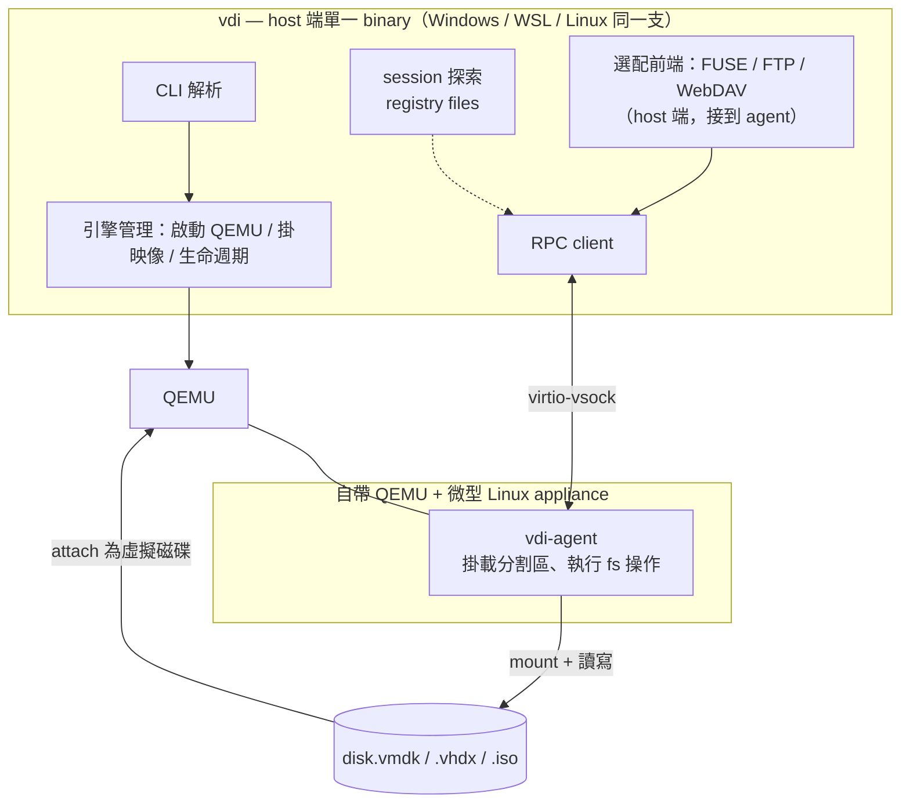

# VDI-Converter 設計文件

一支命令列工具：建立 / 轉換虛擬磁碟映像（vmdk / vhdx / iso），並且**像掛載一樣**
直接對映像內部檔案系統做完整讀寫 CRUD。

## 三條不可退讓的原則

1. **存取能力**：FAT16 / FAT32 / exFAT / ext2 / ext3 / ext4 六種檔案系統，
   全部都要能**讀**、也能**寫**（copy-in / write / mkdir / rename / rm …）。
2. **獨立在系統之外、到處一樣**：不裝核心驅動、不需要管理員權限、不動到 host 的磁碟管理。
   Windows 原生、WSL、原生 Linux，**同一支 `vdi`、同一組命令、同樣行為**。
   Windows 不需要使用者自己去弄 WSL。
3. **給 AI 用**：`vdi` 內建 MCP server 前端，讓 Claude 或其他 AI 能直接列出、讀取、
   甚至寫入某個 vmdk / vhdx 內的檔案，把映像內容當成可解析的資料來源。

---

## 1. 需求 → 命令

| # | 需求 | 命令 |
|---|------|------|
| 1 | 從資料夾建立 vmdk / vhdx / iso | `vdi image create` |
| 2 | vmdk ⇄ vhdx（＋raw / qcow2 / vhd）互轉 | `vdi image convert` |
| 3 | 映像內檔案 CRUD：copy-in/out、mkdir、rmdir、rename、read、write、stat、size、list | `vdi fs *` |
| 4 | 開啟映像後常駐，直接暴露底層檔案系統，像 NFS/FTP 掛載 | `vdi serve` |
| 5 | 一個 CLI 找到另一個「已開好」的 CLI，跟它溝通做 CRUD | session registry + `--session` |
| 6 | Claude / 其他 AI 直接讀寫、解析映像內檔案 | `vdi mcp` / `vdi serve --mcp` |

---

## 2. 引擎：自帶的微型 Linux appliance

要在**任何 OS 上原生**對這六種檔案系統讀寫，唯一穩定做法是借用 Linux kernel 的
檔案系統驅動。所以 `vdi` **自己帶一個微型虛擬機引擎**，使用者完全無感：

```
vdi (host 端單一 binary)
  │  啟動
  ▼
自帶的 QEMU  +  自帶的極簡 Linux appliance（kernel + initramfs, 約 30 MB）
  │  appliance 內含：
  │    - 全部檔案系統模組（vfat / exfat / ext2/3/4 / ntfs3 / btrfs / xfs …）
  │    - xorriso、e2fsprogs、exfatprogs、dosfstools
  │    - vdi-agent：在 guest 內執行，透過 virtio-vsock 跟 host 的 vdi 溝通
  ▼
把目標映像（disk.vmdk / disk.vhdx）當作虛擬磁碟掛給這個 VM
  → guest 掛載 → vdi-agent 執行實際的 ls / read / write / mkdir …
  → 結果經 vsock 傳回 host
```

- 這就是 libguestfs 的作法，差別在**我們自己打包、自己控制**，三個平台拿到的是同一份 appliance。
- **加速**：Linux 有 `/dev/kvm` 就用 KVM；Windows 用 WHPX（Windows Hypervisor Platform）；
  WSL2 用巢狀 KVM；都沒有就退回 TCG（純軟體，較慢但一定能跑）。
- appliance 冷開機約 1–2 秒；one-shot 每次付一次，daemon 模式只付一次。
- **建立 / 轉換**用 QEMU 自帶的 `qemu-img`（vmdk / vhdx / vhd / qcow2 / raw 皆讀寫），
  跟 appliance 共用同一份 QEMU 發佈，不需額外相依。

> 實作語言是純內部細節：host 與 guest agent 都編譯成**無 runtime 相依的原生單一執行檔**，
> 使用者不需要安裝任何東西。下面的 Go 只是示意，可換成任何能靜態編譯的語言。

### 發佈物

| 平台 | 內容 |
|------|------|
| Windows | `vdi.exe` + 隨附 `qemu\`（qemu-system-x86_64, qemu-img）+ `appliance\`（kernel, initramfs） |
| Linux (x86_64 / arm64) | `vdi` + 同上，或偵測到系統已有 `qemu-system` 就沿用 |
| 安裝方式 | 單一壓縮檔解壓即用 / Scoop / Homebrew / `.deb` / `.rpm` |

第一次執行時若缺加速器（例如 Windows 沒開 Hyper-V 平台），`vdi doctor` 會明確告知怎麼開，
或直接以 TCG 模式繼續。

---

## 3. 架構



### 兩種模式

1. **One-shot**：`vdi fs ls disk.vmdk:/etc` → 起 appliance、掛映像、做一件事、關掉。
2. **Session（需求 4）**：`vdi serve disk.vmdk --name build01` → appliance 常駐持有映像；
   之後 `vdi fs * --session build01` 走 RPC，映像只開一次、寫入天然序列化。

三個平台的差異**只在** ENG 這一層怎麼起 QEMU（加速器參數不同），其餘完全相同。

---

## 4. CLI 介面

### 4.1 映像層級

```bash
# 需求 1：從資料夾建立
vdi image create ./payload  out.vmdk  --fs ext4  --size 4G  --label DATA
vdi image create ./payload  out.vhdx  --fs exfat --size 8G  --part-table gpt
vdi image create ./payload  out.iso                          # appliance 內 xorriso
    # --part-table gpt|mbr   --align 1M   --boot （El Torito 可開機）

# 需求 2：轉換
vdi image convert  in.vmdk  out.vhdx                          # 依副檔名推斷
vdi image convert  in.vhdx  out.vmdk  --subformat streamOptimized
vdi image convert  in.vmdk  out.raw   --compress
    # 轉完自動 qemu-img check

# 檢視
vdi image info   disk.vmdk           # 格式 / 虛擬大小 / 實際大小 / 分割表
vdi image parts  disk.vmdk           # 每分割區：fs 類型 / UUID / label / 大小

# 環境檢查
vdi doctor                           # QEMU、加速器、appliance 是否就緒
```

### 4.2 檔案系統 CRUD（需求 3）

**TARGET 語法**：`<映像>[@<分割區>][:<映像內路徑>]`，或 `--session <名稱>:<路徑>`
分割區可用序號 `1`、`/dev/sda1`、或 label；省略取第一個可掛載分割區。

```bash
vdi fs ls      disk.vmdk@1:/           [-l] [-a] [-R] [--json]
vdi fs stat    disk.vmdk:/etc/fstab    [--json]   # type/size/mode/uid/gid/atime/mtime/ctime/nlink/inode
vdi fs size    disk.vmdk:/var          [--apparent | --du]
vdi fs read    disk.vmdk:/etc/hostname [-o out.txt]              # 預設 stdout
vdi fs write   disk.vmdk:/etc/hostname [-i in.txt | --stdin | --content "foo"] [--append]
vdi fs mkdir   disk.vmdk:/opt/app      [-p]
vdi fs rmdir   disk.vmdk:/opt/app      [-r]                      # -r 允許非空
vdi fs rm      disk.vmdk:/tmp/x.log
vdi fs rename  disk.vmdk:/a  /b                                  # 同映像內改名
vdi fs mv      disk.vmdk:/a  disk.vmdk:/b
vdi fs cp-in   ./localdir  disk.vmdk:/opt/app   [-r]             # copy in（走 tar 串流）
vdi fs cp-out  disk.vmdk:/opt/app  ./localdir   [-r]             # copy out
vdi fs chmod   disk.vmdk:/x  0644
vdi fs chown   disk.vmdk:/x  0:0
vdi fs df      disk.vmdk@1                                       # 容量 / 已用 / 可用
```

- 無 `--session` → one-shot（自動起、自動關 appliance）。
- 有 `--session NAME` → 打包成 RPC 送給該 daemon。
- FAT / exFAT 無 Unix 權限 → `chmod` / `chown` 回 `ENOTSUP`（`--strict=false` 則靜默略過）。

### 4.3 Daemon / 掛載（需求 4）

```bash
vdi serve disk.vmdk \
    --name build01 \                 # session 名稱，省略取檔名
    --partition 1 \
    --readonly \                     # 允許多個唯讀 session 併存
    --mount  X:  (Windows) | /mnt/build01 (Linux) \   # 選配：host 端掛成磁碟機/目錄
    --ftp    127.0.0.1:2121 \        # 選配：內建 FTP
    --webdav 127.0.0.1:8080 \        # 選配：內建 WebDAV
    --mcp    stdio | 127.0.0.1:7333 \  # 選配：MCP server 前端（給 AI）
    --idle-timeout 30m

vdi sessions                         # 列出本機所有在跑的 session（需求 5 探索）
vdi session info  build01
vdi session stop  build01
vdi session logs  build01
```

- **Windows 的 `--mount X:`**：host 端 `vdi` 用 WinFsp 把 agent 的檔案系統呈現成一顆磁碟機。
- **Linux 的 `--mount /mnt/x`**：host 端用 FUSE。
- FTP / WebDAV：跨平台一致，任何 FTP/WebDAV client（含檔案總管）都能連。

### 4.4 MCP server 前端（給 Claude / 其他 AI）

目標：讓 AI 把某個 vmdk / vhdx 的內容當成可讀寫的資料來源。

```bash
# 方式 A：一步到位，AI client（如 Claude Desktop / Claude Code）用 stdio 直接啟動
vdi mcp disk.vmdk@1                       # 開映像 + 講 MCP over stdio，結束即關

# 方式 B：接上已經在跑的 session（多個 AI / 人 同時存取同一個映像）
vdi serve disk.vmdk --name build01 --mcp 127.0.0.1:7333
#   → 任何 MCP client 連 127.0.0.1:7333，操作經同一個 daemon 序列化
```

MCP client 設定範例（Claude Desktop `claude_desktop_config.json`）：

```jsonc
{ "mcpServers": {
    "vdi-disk": { "command": "vdi", "args": ["mcp", "C:\\images\\disk.vmdk@1"] } } }
```

**匯出的 MCP tools**（讀 + 寫，對齊 §4.2）：

| tool | 說明 |
|------|------|
| `list_dir(path, recursive?)` | 列目錄，回傳名稱 / 型別 / 大小 / mtime |
| `stat(path)` | 檔案屬性（type/size/mode/uid/gid/times/inode） |
| `read_file(path, offset?, length?)` | 讀內容；文字回字串、二進位回 base64 + 標註 |
| `read_file_text(path, max_bytes?)` | 便利版：直接回文字，超過上限截斷並標註 |
| `write_file(path, content, encoding?, append?)` | 寫 / 覆寫 / 附加 |
| `mkdir(path, parents?)` / `rmdir(path, recursive?)` / `remove(path)` | |
| `rename(src, dst)` | |
| `copy_in(host_path, dst)` / `copy_out(src, host_path)` | 與 host 檔案系統交換 |
| `disk_info()` | 分割表、各分割區 fs 型別 / label / 用量 |
| `grep(pattern, path, glob?)` | 在映像內遞迴搜尋（agent 端執行，不整包拉出來） |

**MCP resources**：把映像內檔案樹以 `vdi://build01/<path>` 形式暴露，AI 可直接
「附加」某個檔案或目錄作為 context。

**安全**：
- 預設**唯讀**；要讓 AI 寫入必須明確 `--mcp-writable`。
- `--mcp-root /some/subdir` 限制 AI 只能看到映像內某個子樹。
- `--mcp-readonly-paths` / `--mcp-deny` 黑白名單。
- 所有 AI 的寫入一樣經過 daemon 的單寫者序列化與路徑逃逸檢查（§8）。

---

## 5. Session 模型與探索（需求 4 + 5）

### 5.1 Registry

每個 `vdi serve` 啟動時寫入 registry 目錄（跨平台一致的邏輯位置）：

- Windows：`%LOCALAPPDATA%\vdi\sessions\<name>.json`
- Linux / WSL：`$XDG_RUNTIME_DIR/vdi/sessions/` 或 `~/.vdi/sessions/`

```jsonc
{
  "name": "build01",
  "pid": 48213,                       // host 端 vdi serve 的 pid
  "image": "C:\\data\\disk.vmdk",
  "image_format": "vmdk",
  "partition": "/dev/sda1",
  "fs_type": "ext4",
  "readonly": false,
  "rpc": { "transport": "tcp", "addr": "127.0.0.1", "port": 53341,
           "token": "<32-byte base64>" },
  "mounts": { "fs": "X:", "ftp": null, "webdav": null },
  "started_at": "2026-08-31T09:12:04Z",
  "protocol_version": 1
}
```

啟動時 `O_EXCL` 建檔（擋同名），權限 `0600`；程序結束刪除。

### 5.2 探索流程

1. 掃 registry 目錄。
2. 逐一驗活：`pid` 存活 → RPC 埠可連 → `ping` 有回應。
3. 死掉的自動清除。
4. `--session` 未指定但只有一個活著 → 直接用；多個 → 報錯要求指名。

### 5.3 Wire protocol：JSON-RPC 2.0

- **host client ↔ host daemon**：loopback TCP（`127.0.0.1` + per-session token）。
  跨平台一致；WSL ↔ Windows 也走 loopback。
- **host daemon ↔ guest agent**：virtio-vsock（同一份 JSON-RPC，換傳輸層）。
- 方法對齊 CLI：`fs.ls` `fs.stat` `fs.read` `fs.write` `fs.mkdir` `fs.rmdir` `fs.rm`
  `fs.rename` `fs.copyIn` `fs.copyOut` `fs.chmod` `fs.chown` `fs.df` `session.info` `ping`。
- 大檔：`fs.read` / `fs.write` 支援 `offset`+`length` 分塊；`cp-in` / `cp-out` 走 tar 串流，
  另開一條 raw data channel 帶 request id（不塞進 JSON base64）。

範例：

```jsonc
// → { "jsonrpc":"2.0","id":7,"method":"fs.stat","params":{"token":"…","path":"/etc/fstab"} }
// ← { "jsonrpc":"2.0","id":7,"result":{
//     "type":"file","size":283,"mode":"0644","uid":0,"gid":0,
//     "atime":1756631521,"mtime":1756628010,"ctime":1756628010,"nlink":1,"inode":1179649 } }
```

錯誤碼：`-32001` 不存在、`-32002` 唯讀、`-32003` 非目錄、`-32004` 目錄非空、
`-32005` 空間不足、`-32006` 權限、`-32007` 此 FS 不支援該操作。

---

## 6. 內部抽象

`vdi-agent`（guest 內）實作真正的檔案操作；host 端的 one-shot 與 daemon 只是
「起 VM → 發 RPC → 收結果 → （one-shot 才）關 VM」。

```go
// guest 端 agent 的操作介面（host 端透過 RPC 呼叫）
type FS interface {
    Open(dev string, ro bool) error       // mount -o [ro] <dev> /mnt
    Close() error
    Type() string
    Df() (DfInfo, error)

    Ls(path string, long, recursive bool) ([]DirEntry, error)
    Stat(path string) (StatInfo, error)
    Read(path string, off int64, n int64) ([]byte, error)
    TreeSize(path string, apparent bool) (int64, error)

    Write(path string, data []byte, off int64, append bool) error
    Mkdir(path string, parents bool) error
    Rmdir(path string, recursive bool) error
    Rm(path string) error
    Rename(src, dst string) error
    Chmod(path string, mode uint32) error
    Chown(path string, uid, gid uint32) error

    UploadTree(tarStream io.Reader, dst string) error   // cp-in
    DownloadTree(src string, tarStream io.Writer) error // cp-out
}
```

guest 內實作直接用 Linux syscalls / `mount(2)` / `os` 套件——因為 kernel 已經
掛好對應的檔案系統，六種 FS 走同一份程式碼。

### 建立（需求 1）在 guest 內的步驟

```
host: qemu-img create -f <fmt> out.<ext> <size>       # 空白映像
host: 把 out.<ext> attach 給 appliance（可寫）
agent: parted <dev> mklabel gpt|msdos ; mkpart ...
agent: mkfs.vfat / mkfs.exfat / mkfs.ext4 ... <part>   # 依 --fs
agent: mount <part> /mnt ; tar 解開 host 傳入的 payload 串流到 /mnt ; umount
```

ISO：`agent: xorriso -as mkisofs -R -J ... -o /out.iso /payload`（payload 由 host 串流進來）。

---

## 7. 各需求對照

| 需求 | 實作 |
|------|------|
| 1 建立 | §6「建立」：qemu-img 建空白 → agent 分割 / mkfs / 解 tar；ISO 走 xorriso |
| 2 轉換 | `qemu-img convert -p -O <fmt>`＋轉後 `qemu-img check` |
| 3 CRUD | §6 `FS` 介面，one-shot 與 session 共用 |
| 4 掛載 | `vdi serve` 常駐 appliance；host 端前端：WinFsp(Win) / FUSE(Linux) / FTP / WebDAV / MCP |
| 5 找另一支工具 | §5 registry + 探索 + JSON-RPC；`vdi fs write --session build01 /x --content ...` |
| 給 AI 用 | §4.4 MCP server 前端（`vdi mcp` 或 `vdi serve --mcp`），讀寫 tools + resources |

---

## 8. 併發與安全

- **單寫者**：一個可寫 session 對一個映像；registry `O_EXCL` 擋重複。要併發就都連同一個 daemon。
- **多讀者**：`--readonly` session 可多開（各自一台 appliance，唯讀掛載）。
- daemon 內每個寫操作序列化（agent 單執行緒處理 mutation）。
- RPC 只綁 `127.0.0.1` + per-session token；registry 檔 `0600`。
- 路徑正規化：拒絕 `..` 逃逸、symlink 逃出掛載點（`--follow-symlinks` 才放行）。
- `image create` 目標已存在需 `--force`。
- VM 邊界本身也是一層隔離：映像若有惡意內容，爆的是拋棄式 appliance，不是 host。

---

## 9. 專案結構

```
VDI-Converter/
├── go.mod
├── cmd/vdi/                 # host 端 CLI 進入點
├── cmd/vdi-agent/           # guest 內 agent（交叉編譯進 initramfs）
├── internal/
│   ├── cli/                 # image / fs / serve / sessions / doctor 子命令
│   ├── target/              # TARGET 語法解析 image@part:path
│   ├── image/               # qemu-img / xorriso 包裝
│   ├── engine/              # 起 QEMU：linux_kvm.go windows_whpx.go tcg.go
│   ├── vsock/               # host ↔ agent 傳輸
│   ├── rpc/                 # JSON-RPC client/server、token、分塊、tar channel
│   ├── registry/            # sessions 讀寫 + 驗活 + 清死
│   ├── daemon/              # serve：生命週期 + idle timeout
│   └── frontend/            # winfsp.go(build tag) fuse.go ftp.go webdav.go mcp.go
├── appliance/
│   ├── kernel/              # 設定檔 + 建置腳本（buildroot / 自訂 .config）
│   ├── initramfs/           # busybox + e2fsprogs + exfatprogs + dosfstools + xorriso
│   └── build.sh
└── test/
    ├── roundtrip_test.go    # create → convert → serve → CRUD → verify（六種 FS 各一輪）
    └── fixtures/
```

---

## 10. 里程碑

| 階段 | 內容 | 狀態 |
|------|------|------|
| **M1** | `vdi doctor`、`image create` / `convert` / `parts`、`fs` one-shot 全套 CRUD + grep（六種 FS，WSL 引擎） | ✅ 實測 |
| **M3** | `vdi serve` + registry + JSON-RPC + `--session` + one-shot 自動重用 session | ✅ 實測 |
| **M4** | `vdi mcp` + `vdi serve --mcp`：MCP server 前端（給 AI 讀寫，TCP shim；官方 SDK stdio 選配） | ✅ 實測 |
| **M2** | 自帶 QEMU + 微型 appliance 引擎（Windows 完全免 WSL；WHPX，失敗退 TCG） | ⏳ `appliance/` 骨架 |
| **M5** | host 前端：FUSE(Linux) / WinFsp(Windows) / FTP / WebDAV | ⏳ |
| **M6** | 發佈：Windows zip / Homebrew / Scoop / deb / rpm | ⏳ |

實作以 Python 完成（`src/vdi/`），host 與 guest agent 之後可換成靜態編譯語言。目前引擎為 `wsl`（libguestfs）
與 `local`（測試用）；`qemu` 自帶 appliance 引擎為 M2。

---

## 11. 風險

| 風險 | 緩解 |
|------|------|
| Windows 未開「Windows Hypervisor Platform」→ 無 WHPX | 自動退 TCG（慢但可用）；`vdi doctor` 指示如何開啟 |
| appliance 冷開機延遲（1–2s） | daemon 模式攤平；one-shot 提供 `--keep-warm` 選項留一台待命 |
| 隨附 QEMU + appliance 讓發佈物變大（~40–60 MB） | 可接受；或提供 slim 版首次執行下載 appliance |
| WSL2 內是否有巢狀虛擬化 | 有則 KVM，無則 TCG；功能不受影響 |
| `qemu-img` vhdx 動態子格式邊角 | 轉完一律 `qemu-img check`；`--preallocation full` 保底 |
| WinFsp 需另裝驅動 | `--mount X:` 才需要；未裝時 `vdi doctor` 提示，FTP/WebDAV 為無驅動替代 |
| 大檔透過 RPC | `read/write` 分塊；`cp-in/out` 走 tar 串流 + 獨立 data channel |
